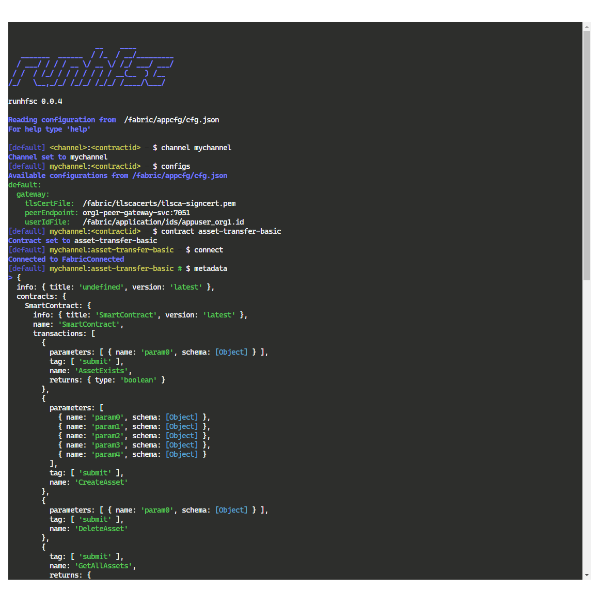

# runhfsc-web

An example of packaging an Hyperledger Fabric client application, and running it on K8S, along side the test-network-k8s



## Dev Notes

- Express Application, to provide simple server to render a webpage
  - Note the 'genesis' of this repo was similar but had need to render different pages, depending on use. Search ampretia/code-hats
- Using the `xterm.js` library to provide an in browser console
- Using `node-ty` to link, via websockets, the `xterm.js` console to a running instance of `runhfsc`

- The express server portion is in `src` and the code for in browser is in `clientsrc` Note that these have different typescript configurations
- `Rollup.js` is used to produce the browser code bundle (hence a different ts configuration is needed)

- A version of `runfsc` is copied into the dockerfile and installed.
  - Clone `runhfsc` and `npm run build && npm pack`
- A `k8s/application_deployment.yaml` is present to run this in k8s alongside the `test-network-k8s`

## Rough Guide to usage

```
cd <wherever>/fabric-samples/test-network-k8s
./network kind
./network up
./network channel create
./network chaincode deploy
./network application


cd <wherever>/runhfsc-web
docker build -t runhfsc-web:0.0.4 .
kind load docker-image runhfsc-web:0.0.4
kubectl -n test-network apply -f k8s/application-deployment.yaml
```


Navigate to `runhfsc-web.vcap.me`

Commands to run - note that the default profile here is the only one and matches the Fabric network configuration created above.

```
channel mychannel
contract asset-transfer-basic
connect
metadata
evaluate @json getAllAssets
submit initLedger
evaluate @json getAllAssets
```

